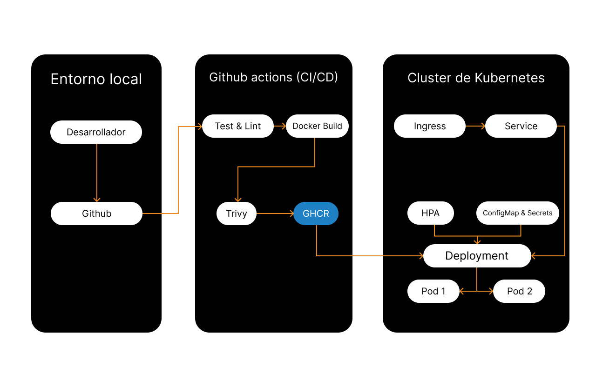

# 🚀 Devsu DevOps Technical Test - Node.js

Este repositorio contiene la resolución integral de la prueba técnica DevOps, implementando un ciclo completo de entrega de software para una aplicación Node.js. Se priorizó la seguridad, la automatización y el uso de herramientas Cloud Native.

## 🏗 Arquitectura del Sistema



## 🛠 Herramientas Utilizadas
- **Contenedores:** Docker (Multi-stage builds)
- **Orquestación:** Kubernetes (Deployments, HPA, Services, Ingress, ConfigMaps, Secrets)
- **CI/CD:** GitHub Actions
- **Registro de Imágenes:** GitHub Container Registry (GHCR)
- **Seguridad:** Trivy (Vulnerability Scanner)

## 🧠 Decisiones Técnicas y Buenas Prácticas

### 1. Dockerización (Seguridad y Optimización)
- **Multi-stage Build:** Se separó el entorno de dependencias (`builder`) del entorno de ejecución (`runner`) usando la imagen `node:20-alpine` para reducir drásticamente la superficie de ataque y el peso final.
- **Usuario Non-Root:** El contenedor ejecuta la aplicación utilizando el usuario nativo `node` en lugar de `root`, mitigando riesgos de escalamiento de privilegios.
- **Observabilidad Interna:** Se implementó un `HEALTHCHECK` nativo en Docker para validar la disponibilidad del servicio HTTP.

### 2. Orquestación en Kubernetes
- **Escalabilidad (HPA):** Se configuró un `HorizontalPodAutoscaler` con un mínimo de 2 réplicas (escalando hasta 5) basado en la métrica de CPU al 70%. Para que esto funcione, se definieron estrictamente los `resources` (requests/limits) en el Deployment.
- **Gestión de Configuración:** Los parámetros de entorno se inyectan dinámicamente mediante `ConfigMaps` y los datos sensibles mediante `Secrets` (codificados en Base64).
- **Exposición:** Se definió un `Ingress` configurado para enrutar el tráfico localmente mediante el host `devsu-demo.local`.

### 3. Pipeline CI/CD (GitHub Actions)
- **Shift-Left Security:** Se integró un escaneo de vulnerabilidades con `Trivy` directamente en el pipeline para detectar riesgos antes del despliegue.
- **Registro Nativo:** Para evitar la dependencia de credenciales externas (Docker Hub), la imagen compilada se almacena automáticamente en GitHub Container Registry (GHCR).
- **Validación de Infraestructura:** El pipeline incluye la creación efímera de un clúster local usando `Kind` (Kubernetes in Docker). Esto asegura que los manifiestos YAML sean sintácticamente correctos y se apliquen sin errores antes de finalizar el job.

## 🚀 Cómo ejecutar el proyecto localmente

### Prerrequisitos
- Docker & Docker Compose
- Minikube o Docker Desktop (con Kubernetes habilitado)
- `kubectl` instalado

### Pasos de despliegue

1. **Clonar el repositorio:**
   ```bash
   git clone 
   cd devsu-demo-devops-nodejs