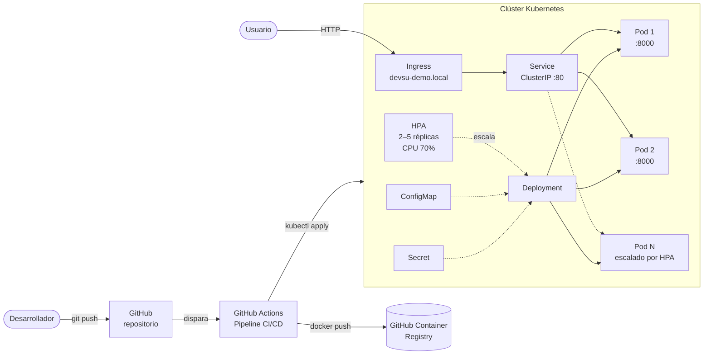
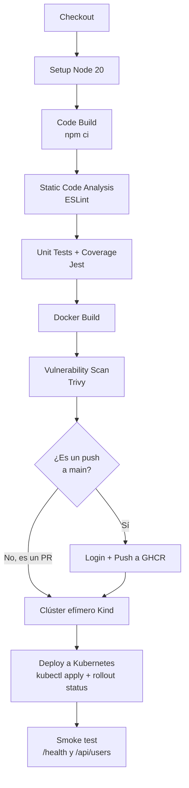
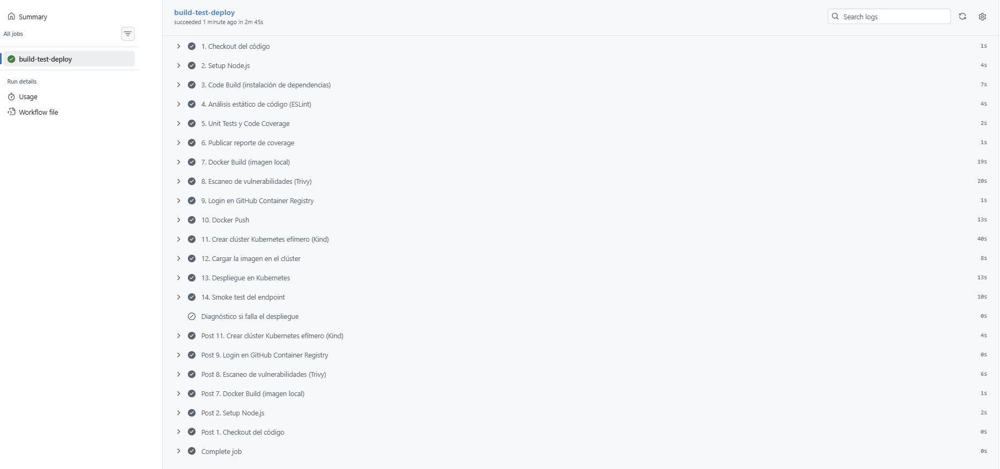
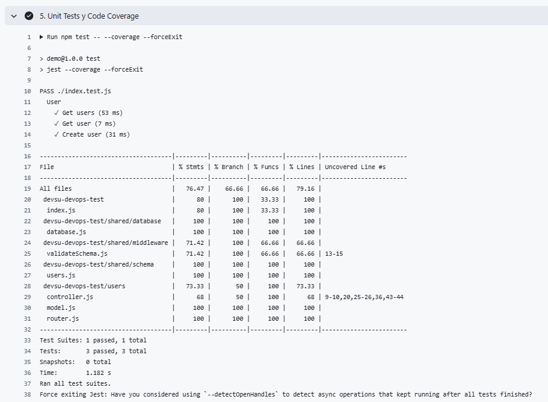
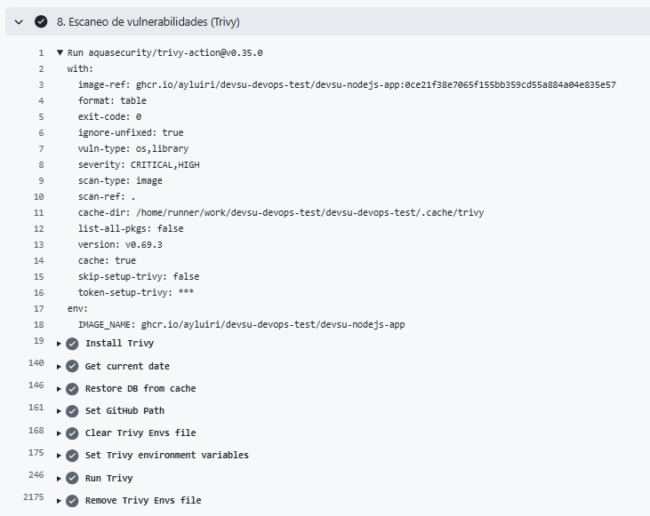
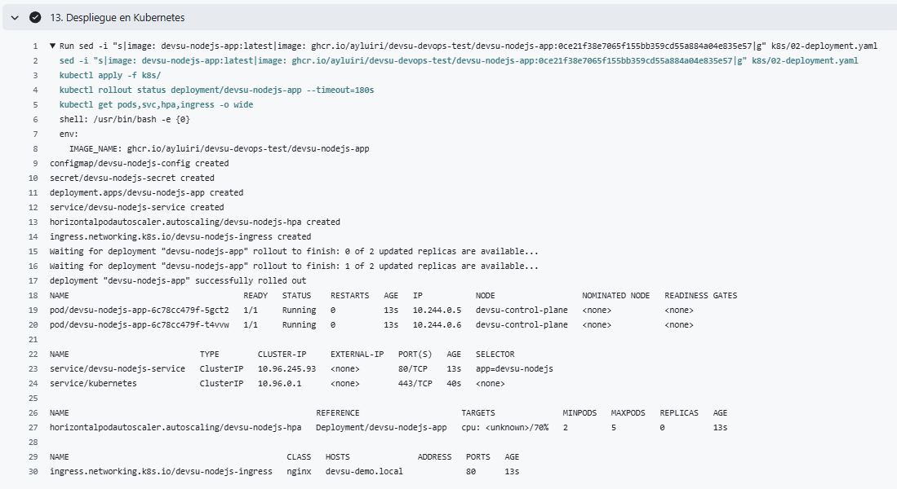

# Devsu DevOps Technical Test – Node.js

Resolución de la prueba técnica DevOps de Devsu sobre la aplicación `demo-devops-nodejs`: una API REST de usuarios (Express + Sequelize + SQLite) que fue dockerizada, desplegada en Kubernetes y automatizada con un pipeline CI/CD en GitHub Actions.

- **Repositorio:** https://github.com/ayluiri/devsu-devops-test
- **Ejecuciones del pipeline:** https://github.com/ayluiri/devsu-devops-test/actions
- **Imagen Docker:** `ghcr.io/ayluiri/devsu-devops-test/devsu-nodejs-app`

---

## Índice

1. [Arquitectura](#-arquitectura)
2. [Estructura del repositorio](#-estructura-del-repositorio)
3. [Dockerización](#-dockerización)
4. [Pipeline CI/CD](#-pipeline-cicd)
5. [Kubernetes](#️-kubernetes)
6. [Cómo ejecutar el proyecto](#-cómo-ejecutar-el-proyecto)
7. [Endpoints de la API](#-endpoints-de-la-api)
8. [Consideraciones para producción](#-consideraciones-para-producción)
9. [Requerimientos no cubiertos y por qué](#-requerimientos-no-cubiertos-y-por-qué)
10. [Evidencia de ejecución](#-evidencia-de-ejecución)

---

## Arquitectura

### Vista general



### Flujo del pipeline



---

## Estructura del repositorio

```
.
├── .github/workflows/ci-cd.yaml   # Pipeline CI/CD
├── k8s/
│   ├── 01-config.yaml             # ConfigMap + Secret
│   ├── 02-deployment.yaml         # Deployment (2 réplicas, probes, recursos, seguridad)
│   ├── 03-service-hpa.yaml        # Service ClusterIP + HorizontalPodAutoscaler
│   └── 04-ingress.yaml            # Ingress (NGINX)
├── shared/                        # Base de datos, middleware y schemas
├── users/                         # Router, controller y modelo de usuarios
├── Dockerfile                     # Build multi-stage
├── .dockerignore
├── eslint.config.js               # Reglas de análisis estático
├── index.js                       # Entrada de la app (incluye /health)
└── index.test.js                  # Tests unitarios
```

---

## Dockerización

| Aspecto | Decisión | Motivo |
|---|---|---|
| Imagen base | `node:20-alpine` | Imagen liviana, con menor superficie de ataque. |
| Build | Multi-stage (`builder` → `runner`) | La imagen final solo contiene el código necesario para ejecutar la app. |
| Usuario | `USER node` (no root) | Reduce el riesgo de escalamiento de privilegios. |
| Variables de entorno | `NODE_ENV`, `PORT`, `DATABASE_NAME` | Configurables sin reconstruir la imagen. La app lee `PORT` desde el entorno. |
| Puerto | `8000` | Puerto por defecto de la aplicación. |
| Healthcheck | `HEALTHCHECK` contra `/health` | Endpoint liviano agregado a la app, que no depende de la base de datos. |
| Persistencia | `/app/data` con permisos para `node` | Es el único directorio escribible; el resto del filesystem queda en solo lectura. |
| `.dockerignore` | Excluye `.env`, `.git`, tests, `k8s/`, `coverage/`, etc. | Evita filtrar secretos y reduce el contexto de build. |

> **Nota:** el archivo `.env` del proyecto original no se copia a la imagen. Las credenciales se inyectan en tiempo de ejecución mediante variables de entorno (Secret de Kubernetes).

---

## Pipeline CI/CD

Archivo: [`.github/workflows/ci-cd.yaml`](.github/workflows/ci-cd.yaml)

Se ejecuta en cada `push` y `pull_request` sobre `main`, y también de forma manual (`workflow_dispatch`).

| # | Paso | Herramienta | Detalle |
|---|---|---|---|
| 1 | Checkout | `actions/checkout@v5` | |
| 2 | Setup | `actions/setup-node@v5` | Node 20 con caché de npm. |
| 3 | **Code Build** | `npm ci` | Instalación reproducible a partir del `package-lock.json`. |
| 4 | **Static Code Analysis** | ESLint 9 | Detecta variables sin definir, variables sin uso y comparaciones laxas. |
| 5 | **Unit Tests + Code Coverage** | Jest | `npm test -- --coverage`. |
| 6 | Reporte de coverage | `actions/upload-artifact@v4` | El reporte HTML queda descargable como artifact del run. |
| 7 | **Docker Build** | `docker/build-push-action@v6` | Tags `latest` y `<commit SHA>`. |
| 8 | **Vulnerability Scan** (opcional) | Trivy `v0.35.0` | Reporta vulnerabilidades CRITICAL y HIGH antes de publicar la imagen. |
| 9–10 | **Docker Push** | GHCR | Solo en push a `main`; en los PRs no se publica. Autenticación con `GITHUB_TOKEN`, sin credenciales externas. |
| 11–12 | Clúster efímero | Kind | Se crea un clúster Kubernetes dentro del runner y se carga la imagen recién construida. |
| 13 | **Deploy a Kubernetes** | `kubectl` | Aplica los manifiestos y espera a que el rollout finalice (`rollout status`). |
| 14 | Smoke test | `curl` | Verifica `/health` y `/api/users` a través del Service. |
| — | Diagnóstico | `kubectl describe/logs` | Solo se ejecuta si algún paso falla. |

### Decisiones del pipeline

- **Escanear antes de publicar.** La imagen se construye localmente, se escanea con Trivy y recién después se sube al registry.
- **Tag inmutable por commit.** Cada imagen se etiqueta con el SHA del commit, de modo que el despliegue es trazable y se puede volver atrás. `latest` se mantiene solo como referencia.
- **Versiones fijas de las actions.** Trivy se usa en `v0.35.0` y no en `@master`. En marzo de 2026 los tags de `aquasecurity/trivy-action` fueron comprometidos (CVE-2026-33634). En un entorno productivo, todas las actions deberían fijarse por SHA completo de commit.
- **Runner fijo (`ubuntu-24.04`).** Se evita `ubuntu-latest`, que cambia de versión de forma automática.
- **Validación real del despliegue.** No alcanza con que `kubectl apply` termine sin errores: el pipeline espera a que los pods estén *Ready* (las readiness probes pasan) y prueba el endpoint.

---

## Kubernetes

| Recurso | Archivo | Detalle |
|---|---|---|
| **ConfigMap** | `01-config.yaml` | `NODE_ENV`, `PORT`, `DATABASE_NAME`. |
| **Secret** | `01-config.yaml` | `DATABASE_USER`, `DATABASE_PASSWORD` (valores de demo). |
| **Deployment** | `02-deployment.yaml` | 2 réplicas, estrategia `RollingUpdate` sin indisponibilidad (`maxUnavailable: 0`). |
| **Service** | `03-service-hpa.yaml` | `ClusterIP`, puerto 80 → 8000. |
| **HPA** | `03-service-hpa.yaml` | Mínimo 2 y máximo 5 réplicas, escala con CPU promedio > 70%. |
| **Ingress** | `04-ingress.yaml` | Clase `nginx`, host `devsu-demo.local`. |

### Buenas prácticas aplicadas en el Deployment

- **Requests y limits** de CPU y memoria. Son obligatorios para que el HPA pueda calcular el porcentaje de uso.
- **Readiness probe** sobre `/health`: un pod no recibe tráfico hasta estar listo.
- **Liveness probe** sobre `/health`: Kubernetes reinicia el contenedor si deja de responder.
- **Security context:** `runAsNonRoot`, `allowPrivilegeEscalation: false`, `readOnlyRootFilesystem: true` y todas las capabilities de Linux eliminadas.
- **Volúmenes `emptyDir`** para `/app/data` (SQLite) y `/tmp`, ya que el filesystem raíz es de solo lectura.

---

## Cómo ejecutar el proyecto

### Prerrequisitos

- Node.js 20 y npm
- Docker
- Minikube **o** Docker Desktop con Kubernetes habilitado
- `kubectl`

### 1. Clonar el repositorio

```bash
git clone https://github.com/ayluiri/devsu-devops-test.git
cd devsu-devops-test
```

### 2. Ejecutar la aplicación sin contenedores

```bash
npm ci
npm test -- --coverage   # tests y cobertura
npx eslint@9 .           # análisis estático
npm start                # levanta la API en http://localhost:8000
```

### 3. Ejecutar con Docker

```bash
docker build -t devsu-nodejs-app:latest .
docker run -d --name devsu-app -p 8000:8000 devsu-nodejs-app:latest

# Verificar el estado del healthcheck (debería pasar a "healthy")
docker ps
curl http://localhost:8000/health
```

### 4. Desplegar en Kubernetes local

#### Opción A: Minikube

```bash
minikube start
minikube addons enable ingress          # controlador NGINX Ingress
minikube addons enable metrics-server   # necesario para el HPA

# Construir la imagen dentro del Docker de Minikube
eval $(minikube docker-env)
# En PowerShell: & minikube -p minikube docker-env --shell powershell | Invoke-Expression
docker build -t devsu-nodejs-app:latest .

kubectl apply -f k8s/
kubectl rollout status deployment/devsu-nodejs-app
kubectl get pods,svc,hpa,ingress
```

Para acceder por el Ingress, agregar al archivo `hosts` (en Windows: `C:\Windows\System32\drivers\etc\hosts`) la IP que devuelve `minikube ip`:

```
<IP_DE_MINIKUBE>  devsu-demo.local
```

En Windows y macOS con el driver Docker, puede ser necesario ejecutar `minikube tunnel` y usar `127.0.0.1` como IP.

#### Opción B: Docker Desktop

```bash
# Instalar el controlador NGINX Ingress
kubectl apply -f https://raw.githubusercontent.com/kubernetes/ingress-nginx/main/deploy/static/provider/cloud/deploy.yaml

# Instalar metrics-server (necesario para el HPA)
kubectl apply -f https://github.com/kubernetes-sigs/metrics-server/releases/latest/download/components.yaml

docker build -t devsu-nodejs-app:latest .
kubectl apply -f k8s/
kubectl rollout status deployment/devsu-nodejs-app
```

Agregar `127.0.0.1  devsu-demo.local` al archivo `hosts`.

> Si `metrics-server` no arranca en Docker Desktop por certificados, agregar el argumento `--kubelet-insecure-tls` a su Deployment.

#### Alternativa sin Ingress

```bash
kubectl port-forward svc/devsu-nodejs-service 8080:80
curl http://localhost:8080/api/users
```

### 5. Probar el escalamiento horizontal

```bash
# Generar carga
kubectl run load-generator --rm -it --image=busybox:1.36 --restart=Never -- \
  /bin/sh -c "while true; do wget -q -O- http://devsu-nodejs-service/api/users; done"

# En otra terminal, observar el HPA
kubectl get hpa devsu-nodejs-hpa --watch
```

---

## Endpoints de la API

| Método | Ruta | Descripción |
|---|---|---|
| `GET` | `/health` | Estado del servicio (usado por Docker y Kubernetes). |
| `GET` | `/api/users` | Lista todos los usuarios. |
| `GET` | `/api/users/:id` | Obtiene un usuario por ID. |
| `POST` | `/api/users` | Crea un usuario. |

Ejemplo de creación:

```bash
curl -X POST http://devsu-demo.local/api/users \
  -H "Content-Type: application/json" \
  -d '{"dni": "1234567890", "name": "Test"}'
```

---

## Consideraciones para producción

Lo siguiente no fue implementado por el alcance de la prueba, pero sería necesario para un entorno productivo real:

- **Base de datos externa.** La app usa SQLite en un volumen `emptyDir`, por lo que **cada réplica tiene su propia base de datos y los datos se pierden al reiniciar el pod**. En producción se reemplazaría por una base gestionada (por ejemplo PostgreSQL en Amazon RDS, Azure Database o Cloud SQL), compartida por todas las réplicas.
- **Inicialización de la base.** La app ejecuta `sequelize.sync({ force: true })` al arrancar, lo que borra las tablas. En producción se usarían migraciones versionadas.
- **Gestión de secretos.** El Secret está versionado con valores de demo. En producción se usaría External Secrets Operator (con AWS Secrets Manager, Azure Key Vault o GCP Secret Manager), Sealed Secrets o HashiCorp Vault.
- **DNS y TLS.** Registrar un dominio real apuntando al Load Balancer del Ingress y emitir certificados automáticamente con **cert-manager** y Let's Encrypt, agregando el bloque `tls` al Ingress.
- **Imagen final más liviana.** Hoy se copian también las dependencias de desarrollo, porque `database.js` importa `dotenv`, que figura como devDependency. Moviendo `dotenv` a `dependencies` se podría usar `npm ci --omit=dev` en la imagen final.
- **Entornos separados.** Namespaces o clústeres distintos para dev, staging y producción, con aprobación manual antes de desplegar a producción (GitHub Environments).
- **GitOps.** Despliegue con Argo CD o Flux en lugar de `kubectl apply` desde el pipeline.
- **Observabilidad.** Métricas con Prometheus y Grafana, logs centralizados y alertas.
- **Alta disponibilidad.** `PodDisruptionBudget` y reglas de `topologySpreadConstraints` para repartir las réplicas entre nodos.
- **Seguridad de red.** `NetworkPolicy` para limitar el tráfico entrante y saliente de los pods.

---

## Requerimientos no cubiertos y por qué

| Requerimiento | Estado | Motivo |
|---|---|---|
| Despliegue en entorno público con URL accesible | No realizado | El despliegue se valida en un clúster efímero (Kind) dentro del pipeline y de forma local con Minikube/Docker Desktop, tal como permite la consigna. |
| Infraestructura con IaC en proveedor público (puntos extra) | No realizado | Opcional. Sería el siguiente paso: un clúster gestionado (EKS, AKS o GKE) creado con Terraform. |
| Escalado del HPA dentro del pipeline | Parcial | El HPA se crea en Kind, pero Kind no incluye `metrics-server`, así que no se prueba el escalado real ahí. Se puede probar en local siguiendo la sección [Probar el escalamiento horizontal](#5-probar-el-escalamiento-horizontal). |
| Ingress dentro del pipeline | Parcial | El recurso se aplica en Kind, pero sin controlador NGINX instalado. El acceso se valida con el smoke test a través del Service. |

---

## 📸 Evidencia de ejecución

Ejecuciones del pipeline: https://github.com/ayluiri/devsu-devops-test/actions

### Pipeline completo


### Reporte de coverage


### Escaneo de vulnerabilidades (Trivy)


### Recursos desplegados en Kubernetes

